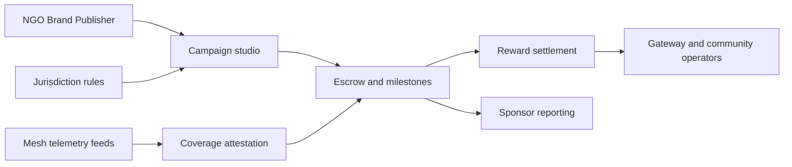

# Relaymint

**Source:** `ai-in-decentralized+ai/InfoDeck_12152017_email/`
**Domain:** `ai-decentralized`
**One-liner:** A connectivity campaign marketplace where NGOs, brands, and app distributors fund mesh-density programmes and settle coverage and outcome rewards — without operating the underlying mesh protocol.
**Wedge:** Humanitarian and emerging-market connectivity sponsors (NGOs, publishers, consumer brands, app distributors) who need reach in 3.9B-unconnected contexts and can fund tokenised incentives, starting with field-proven geographies (Dhaka, Cuba, Labrador) rather than building mesh software themselves.
**Positioning:** Sponsored mesh-density campaign ops. The RightMesh info deck positions software mesh on phones (Wi-Fi, Bluetooth, Wi-Fi Direct) with no hardware, SIM, or middleman; RMESH tokens fuel network growth; buyers include app distributors, publishers, advertisers, NGOs, and enterprises; network loop effects tie developers, apps, users, meshes, gateways, UX, and marketers. Relaymint is the campaign and settlement layer for funding density — distinct from Hopsettle (micropayment channel ops) and Denselink (developer density console).

## Market research synthesis

### Thesis from source

The RightMesh Q1 2018 info deck frames internet accessibility as a human right (UN, 2015) while noting 3.9 billion people — 56% of the world — remain unconnected due to missing infrastructure, slow networks, expensive data, and network interference. Natural disasters, developing nations, and public unrest amplify the need for connectivity that does not depend on expensive, fallible infrastructure or central control.

RightMesh's answer combines a mobile mesh network with token incentivisation: smartphones and IoT devices (20B IoT, 6B smartphones by 2020) form self-forming, self-monitoring, self-healing meshes over Wi-Fi, Bluetooth, and Wi-Fi Direct without additional hardware. Every mesh node carries an Ethereum ID; RMESH tokens transfer between content providers and users to reward behaviour and pay for goods and services, expanding coverage. The deck describes a network loop: more developers → more apps → more app users → more meshes and mesh density → more gateway nodes → better user experience → more marketers and data consumption → lower effective data rates.

Token users and holders span app distributors, content producers and publishers, advertisers, consumer brands, NGO and governmental agencies, autonomous agents, and anyone seeking to connect four billion users. Publishers receive token allocations during the token generation event or from holders; smart contracts mediate flows between internet-selling nodes, consumers, and enterprise sponsors. Field validation appears in co-founder testing in Dhaka (2015), Cuba off-grid sharing (2016), and a Labrador mesh build (2017). The TGE narrative targets $30M contribution, 129M tokens, SDK launch, and a path to one billion mesh nodes by 2020 — signalling that commercial growth depends on sponsored density, not only organic adoption.

The product insight for Relaymint: sponsors need a marketplace to define coverage goals, fund density programmes in target regions, measure outcomes, and settle rewards — the mesh protocol and SDK are upstream infrastructure, not the buyer's operating console.

### Buyer & economic model

- **Primary buyer:** Head of CSR / connectivity partnerships at an NGO or brand, or VP partnerships at an app distributor seeking offline-capable reach.
- **Users:** campaign managers defining geography and KPIs, field programme officers, finance settling token or fiat payouts, mesh ecosystem liaisons validating coverage claims, legal reviewing token vs fiat settlement in restricted jurisdictions.
- **Budget owner / value metric:** marketing/CSR connectivity budget or distribution partnership budget; value metric is cost per newly connected user or per square-km mesh density achieved versus satellite or carrier build-out alternatives.
- **Competing status quo:** one-off NGO grants to local ISPs, Facebook/Google-style connectivity moonshots, direct token purchases without outcome accountability, or bespoke field contracts without measurement.

### Domain constraints

- **Regulatory / trust / safety:** token securities disclaimers in the source deck (not a prospectus; US/Canada residents excluded from TGE); local telecom regulation where sponsored gateways touch licensed spectrum; brand safety in crisis zones; beneficiary privacy when measuring outcomes.
- **Data sensitivity:** campaign analytics should aggregate coverage and adoption; end-user identity stays in mesh SDK boundaries.
- **Change-management realities:** sponsors will not run mesh nodes; Relaymint must integrate with density telemetry from Denselink/Hopsettle operators without owning the protocol stack.

## Business requirements

- BR-1: Sponsors must define campaigns with geography, duration, density or connectivity KPIs, and reward budget before field activation.
- BR-2: Rewards must settle against verified coverage or outcome events (e.g., active mesh nodes, data relay volume, app installs in target zone), not sponsor self-report alone.
- BR-3: The marketplace must support NGO, brand, publisher, and app-distributor buyer types with distinct approval and reporting templates.
- BR-4: Campaign funds must escrow until milestone attestation or be released on a documented partial schedule to protect beneficiaries from sponsor default.
- BR-5: Network loop metrics (apps, users, gateways) must be visible to sponsors as leading indicators, even when final rewards tie to lagging density KPIs.
- BR-6: Field programmes in high-risk regions must support pause and reroute without losing audit trail of committed funds.
- BR-7: Token-denominated and fiat-denominated campaign types must both be supported where legal, with jurisdiction flags inherited from the source deck's securities exclusions.
- BR-8: Publishers and app distributors must be able to co-sponsor campaigns that bundle content distribution with density funding.
- BR-9: Disputes on coverage attestation must enter time-boxed review with third-party or multi-sponsor corroboration options.
- BR-10: Every campaign must export a sponsor-facing statement tying disbursed rewards to attested outcomes for CSR and finance audit.
- BR-11: Autonomous agent/program sponsors (named in the deck) must register automation boundaries so payouts cannot run without human approval thresholds.
- BR-12: Campaign design must reference density modelling assumptions (e.g., urban penetration targets) without requiring sponsors to operate MeshPort or SDK tooling directly.

## User stories

Canonical user stories live in sibling [USER_STORIES.md](USER_STORIES.md).

## System design

### Overview

Relaymint connects sponsors to mesh-density outcomes. Sponsors create campaigns, deposit budgets, and define KPIs; field telemetry from mesh operators (via Denselink/Hopsettle integrations) feeds attestation; verified milestones trigger reward settlement to gateway operators, app partners, or community pools. Escrow, dispute, and reporting wrap the loop effects the deck describes — turning token narrative into accountable campaign operations.

### Actors & boundaries

- **Actors:** sponsor organisations (NGO, brand, publisher, distributor), campaign manager, field verifier, mesh operator (third party), finance, platform admin, end beneficiaries (indirect).
- **Trust boundary:** Relaymint holds campaign economics and attestation records, not mesh routing or wallet keys for end users. Telemetry is read-only from operator systems.
- **Human-in-the-loop points:** campaign approval for high-risk regions; dispute adjudication; escrow release above thresholds; jurisdiction compliance review.

### Core capabilities

1. **Campaign studio** — geography, KPIs, budget, sponsor type, co-funding rules.
2. **Escrow and milestone scheduling** — fund lock, partial release, clawback.
3. **Coverage attestation** — ingest density/node/gateway metrics, sampling, fraud checks.
4. **Reward settlement** — token or fiat rails to qualified recipients.
5. **Sponsor reporting** — loop-effect dashboards and audit statements.
6. **Dispute and pause controls** — crisis pause, attestation challenge, reroute.
7. **Compliance registry** — jurisdiction and buyer-type restrictions.

### Conceptual data

- **Primary entities:** Sponsor, Campaign, CampaignBudget, Milestone, KpiDefinition, Attestation, RewardPayout, EscrowAccount, Dispute, CoverageSnapshot, JurisdictionRule.
- **Critical events:** campaign published, funds escrowed, milestone attested, reward settled, campaign paused, dispute opened/resolved.
- **Retention / audit needs:** financial and attestation records for grant and CSR audit windows; aggregated telemetry only in Relaymint long-term store.

### Integrations (conceptual)

- **Systems of record:** sponsor ERP/treasury, mesh telemetry from Denselink density analytics and Hopsettle settlement feeds, NGO grant management systems.
- **Upstream signals:** node density counts, gateway uptime, app install/geo aggregates, crisis/incident flags.
- **Downstream actions:** payout instructions, sponsor dashboards, pause webhooks to field partners, export to CSR reporting frameworks.

### High-level architecture

### Success metrics

- **Leading:** campaigns reaching first attestation; escrow funded vs planned; attestation dispute rate; time from campaign launch to first verified node density.
- **Lagging:** cost per connected user vs sponsor baseline; density KPI achievement rate in target cities; sponsor renewal rate; CSR audit exceptions; beneficiary reach versus deck-scale aspirations (4B unconnected addressable narrative).

## OpenAPI skeleton

Canonical HTTP surface lives in sibling [openapi.yaml](openapi.yaml). Summary:

- **Base path:** `/v1/...`
- **Auth:** `X-API-Key` for telemetry and payout integrations; Bearer JWT for sponsor and admin consoles.
- **Resource groups:** Campaigns, Programmes, Rewards, Coverage, Settlements, Reporting.
