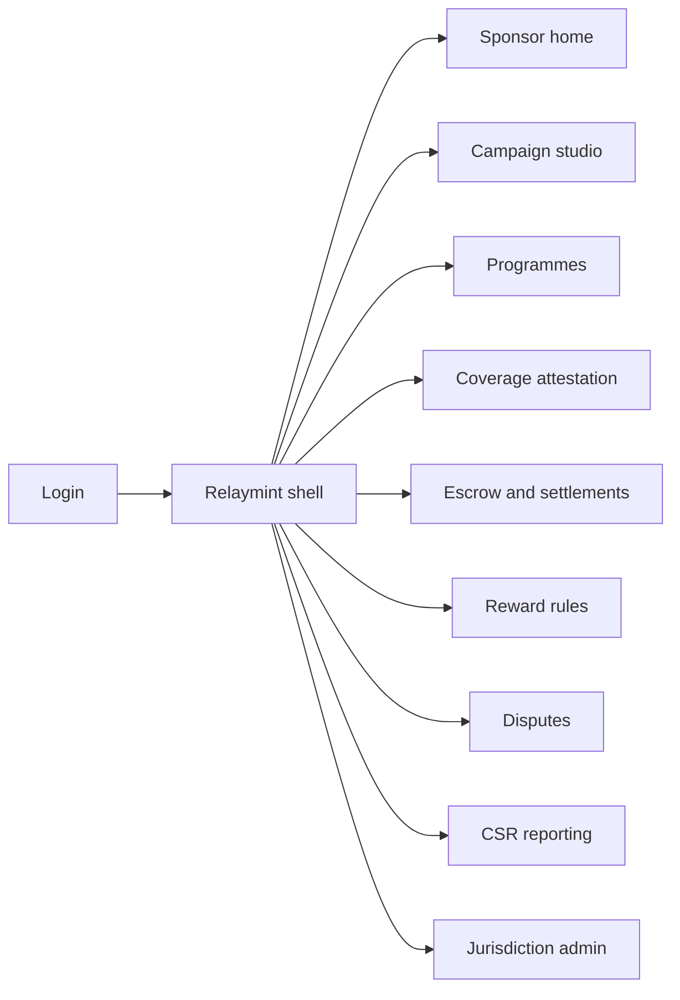
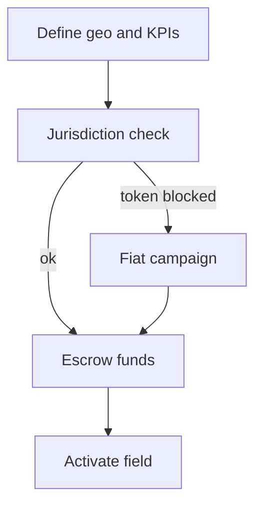

# Relaymint — Web app

**Product:** [PRODUCT.md](./PRODUCT.md)
**Primary surface:** Sponsored mesh-density campaign marketplace console
**Secondary surfaces:** Field verifier attestation desk; finance escrow statement export viewer
**Design thesis:** Relaymint is a grant desk for coverage — the UI metaphor is a field map of funded density, not a crypto trading terminal and not a mesh node dashboard. Visual language is warm earth-ochre and signal-green on deep dusk navy: funded regions feel lit; paused crisis zones dim; disputed attestations flash provisional amber. The Relaymint wordmark sits as a quiet beacon on every campaign money screen so sponsors know whose escrow they are trusting — buyers fund density outcomes, they never operate MeshPort.

## UX research synthesis

### Category peers (best-in-class)

- **Google Ads / Meta Advantage+ geographic campaigns:** Geo targeting, budgets, and outcome KPIs without operating the network. Steal: campaign studio with map + budget + KPI before go-live; reject vanity “impressions” where Relaymint’s unit is density/coverage.
- **GiveDirectly / Airtable+grant ops hybrids:** Escrow-like milestone releases and pause in crisis. Steal: pause/reroute with immutable fund trail; reject opaque “trust us” disbursement.
- **The Graph / Helium-style hotspot explorer UIs (pattern):** Coverage maps tied to economic rewards. Steal: coverage heat as attestation evidence next to payout; reject miner-wallet complexity for NGO buyers.
- **Salesforce Nonprofit / Fluxx:** Buyer-type templates (NGO vs brand). Steal: distinct approval and reporting templates per sponsor type (BR-3).

### Patterns to adopt / reject

- **Adopt:** Campaign studio (geo, duration, KPIs, budget); escrow until attested milestones; coverage attestation from telemetry; token/fiat with jurisdiction flags; co-sponsor programmes; crisis pause; dispute time-box; CSR statements tying payouts to outcomes; human approval thresholds for agent sponsors.
- **Reject:** Wallet trading UI as home; raw RMESH charts as the product; requiring sponsors to run nodes; auto-pay on stale telemetry; purple “Web3 impact” glow; end-user PII in sponsor analytics.

### Trust, density, and workflow constraints from PRODUCT.md

Rewards settle on verified coverage/outcomes, not self-report (BR-2). Escrow protects beneficiaries from sponsor default (BR-4). High-risk regions need pause without losing audit (BR-6). Securities exclusions from the RightMesh deck must block non-compliant token campaigns (BR-7). Statements must reconcile disbursed rewards to attestations for CSR/finance (BR-10). Sponsors see loop metrics as leading indicators without operating SDK tooling (BR-5, BR-12).

## Information architecture

### Nav model

### Roles → default home

| Role | Default home | Why |
|------|--------------|-----|
| NGO programme director | Sponsor home | KPI vs grant obligations |
| Brand marketing lead | Campaign studio | CSR spend to reachable users |
| App distributor / publisher | Programmes | Co-fund density + content (BR-8) |
| Field verification analyst | Coverage attestation | Evidence before payout (BR-2) |
| Finance controller | Escrow and settlements | Milestone statements (BR-10) |
| Platform administrator | Jurisdiction admin | Token/fiat compliance (BR-7) |

### Cross-links to OpenAPI resources

| Nav area | OpenAPI tags / resources |
|----------|---------------------------|
| Campaign studio | Campaigns |
| Programmes / co-funding | Programmes |
| Reward rules | Rewards |
| Coverage attestation | Coverage |
| Escrow / payouts | Settlements |
| CSR / finance exports | Reporting |

## Screen inventory

### Sponsor home

- **Purpose:** Answer “is my funded density delivering, and is escrow healthy?” in one composition.
- **Entry:** Sponsor login default.
- **Layout regions:** Brand + org type badge; map of active campaigns; cost-per-connected-user vs baseline; escrow balance; loop leading indicators (apps/users/gateways); pause/dispute alerts.
- **Primary actions:** Open campaign; fund escrow; export CSR statement.
- **Empty / loading / error:** Empty = “define first geography campaign”; loading = map skeleton.
- **BR / story ties:** BR-5, BR-10; NGO/brand stories.

### Campaign studio

- **Purpose:** Define geography, duration, density/connectivity KPIs, and reward budget before activation.
- **Entry:** Nav → Campaigns; create CTA.
- **Layout regions:** Map drawer; KPI builder; budget; sponsor-type template; density modelling assumptions (read-only reference); jurisdiction rail (token vs fiat).
- **Primary actions:** Save draft; submit for funding; clone field template (Dhaka/Cuba/Labrador-style).
- **Empty / loading / error:** Jurisdiction block on token = fiat-only path; validation on geo+KPI required.
- **BR / story ties:** BR-1, BR-7, BR-12.

### Programme and co-sponsor

- **Purpose:** Bundle multi-campaign programmes and publisher/distributor co-funding.
- **Entry:** Nav → Programmes.
- **Layout regions:** Programme tree; co-sponsor shares; content+density bundle rules; combined escrow view.
- **Primary actions:** Invite co-sponsor; set share; publish programme.
- **Empty / loading / error:** Pending invite = amber wait state.
- **BR / story ties:** BR-3, BR-8.

### Coverage attestation desk

- **Purpose:** Verify density/node/gateway/outcome events from telemetry; catch ghost density.
- **Entry:** Verifier default; campaign → Attestation.
- **Layout regions:** Coverage map samples; telemetry freshness; fraud flags; attest / reject; hold-on-stale banner.
- **Primary actions:** Attest milestone; reject sample; open dispute.
- **Empty / loading / error:** Stale feed = negative-path hold (no auto-pay).
- **BR / story ties:** BR-2; verifier stories.

### Escrow and milestones

- **Purpose:** Lock funds; release on attestation or documented partial schedule.
- **Entry:** Finance home; campaign → Escrow.
- **Layout regions:** Escrow ledger; milestone timeline; clawback controls; beneficiary protection note.
- **Primary actions:** Deposit; release milestone; clawback on fraud; pause releases.
- **Empty / loading / error:** Unfunded = cannot activate field.
- **BR / story ties:** BR-4, BR-6.

### Reward settlement

- **Purpose:** Pay qualified recipients (gateways, partners, community pools) in token or fiat where legal.
- **Entry:** After attested milestone; Settlements nav.
- **Layout regions:** Payout queue; rail (token/fiat); eligibility; human approval threshold for agent sponsors.
- **Primary actions:** Approve payout; batch settle; block automation over threshold (BR-11).
- **Empty / loading / error:** Jurisdiction deny = blocked with reason.
- **BR / story ties:** BR-7, BR-11.

### Crisis pause and reroute

- **Purpose:** Pause payouts in unrest/disaster without losing committed-fund audit.
- **Entry:** Alert or campaign safety controls.
- **Layout regions:** Pause banner; reason codes; reroute geography; immutable pause log.
- **Primary actions:** Pause; resume; reroute budget.
- **Empty / loading / error:** N/A.
- **BR / story ties:** BR-6; NGO safety story.

### Disputes workspace

- **Purpose:** Time-boxed review of contested coverage with multi-sponsor/third-party corroboration.
- **Entry:** Alerts; attestation reject path.
- **Layout regions:** Dispute queue; evidence panes; deadline; resolution → settle or clawback.
- **Primary actions:** Submit corroboration; resolve; escalate.
- **Empty / loading / error:** Empty = no open disputes; expired = auto-resolve policy stated.
- **BR / story ties:** BR-9.

### CSR and finance statements

- **Purpose:** Export sponsor-facing statement: disbursed rewards ↔ attested outcomes.
- **Entry:** Reporting nav; finance close.
- **Layout regions:** Period picker; campaign filter; statement preview; export PDF/CSV.
- **Primary actions:** Generate; download; share auditor link.
- **Empty / loading / error:** No settlements in period = clear empty.
- **BR / story ties:** BR-10.

### Jurisdiction and buyer-type admin

- **Purpose:** Enforce securities exclusions and buyer-type templates.
- **Entry:** Platform admin.
- **Layout regions:** Jurisdiction rules; token campaign allow/deny; NGO/brand/publisher/distributor templates.
- **Primary actions:** Update rule; force fiat; audit log.
- **Empty / loading / error:** N/A.
- **BR / story ties:** BR-3, BR-7.

### Agent sponsor bounds

- **Purpose:** Register automation boundaries so agent/program sponsors cannot payout without human thresholds.
- **Entry:** Admin / advanced sponsor settings.
- **Layout regions:** Automation policy; approval threshold; kill switch.
- **Primary actions:** Set threshold; require human on batch.
- **Empty / loading / error:** Missing policy blocks agent campaigns.
- **BR / story ties:** BR-11.

### Loop indicators panel

- **Purpose:** Show apps → users → meshes → gateways as leading indicators beside lagging density KPIs.
- **Entry:** Embedded on sponsor home and campaign detail.
- **Layout regions:** Loop strip; tooltips that sponsors do not operate SDK.
- **Primary actions:** Drill to campaign; export snapshot.
- **Empty / loading / error:** Partial telemetry = labeled incomplete.
- **BR / story ties:** BR-5, BR-12.

## Key flows

1. **Fund density campaign** — studio define → jurisdiction check → escrow deposit → activate → await attestation; failure: token blocked → fiat path.

2. **Attest → settle** — telemetry sample → attest → milestone release → payout; stale feed holds pay (BR-2, BR-4).

3. **Crisis pause** — unrest flag → pause payouts → optional reroute → resume with full audit (BR-6).

4. **Coverage dispute** — challenge attestation → time box → corroborate → resolve settle/clawback (BR-9).

5. **CSR close** — period statement ties rewards to outcomes for finance/audit (BR-10).

## Design system

### Tokens (CSS variables)

- `--color-ink: #F2EDE4` — primary text on dark
- `--color-dusk-950: #0E1520` — app ground
- `--color-dusk-900: #172233` — panels
- `--color-sand: #C4B49A` — secondary labels
- `--color-ochre: #D4A04A` — funded region / budget accent
- `--color-signal: #3DDC97` — attested coverage
- `--color-amber: #E0A12B` — dispute / provisional
- `--color-coral: #E85D4C` — pause / fraud hold
- `--color-brand: #E8C07A` — Relaymint wordmark
- `--font-display: "Fraunces", serif` — campaign titles / map labels
- `--font-body: "DM Sans", sans-serif`
- `--font-mono: "IBM Plex Mono", monospace` — escrow ids, attestation hashes
- `--space-1`…`--space-8`: 4px scale
- `--radius-sm: 6px`; `--radius-md: 10px`
- `--motion-beacon: 200ms ease-out` — region light-up on fund
- `--motion-pause: 320ms ease-in` — map dim on crisis pause
- Atmosphere: dusk map grain; soft radial glow on funded geographies; field-photo texture optional on login only — never stock crypto cityscapes in console.

### Typography & brand

- Fraunces for campaign names and map callouts; mono for escrow and attestation ids.
- Brand beacon left of chrome on money-bearing views; “Dashboard” never replaces Relaymint.
- Login: brand hero, one headline (“Fund density. Settle on coverage.”), one CTA.

### Do / don’t

- **Do:** Map-first campaign truth; escrow before activate; hold on stale telemetry; distinct NGO/brand templates; aggregate analytics only.
- **Don’t:** Purple Web3 glow; trading charts as home; sponsor node-ops screens; PII heatmaps of beneficiaries; pill spam.

### Accessibility & domain trust cues

- AA+ ochre/signal/coral on dusk; pause state uses icon + “Paused — unrest” text.
- Live regions for attestation and pause events.
- Focus order: studio → escrow → attestation → settle → statement.
- Statements machine-readable for auditors.

## Component patterns

- **DensityMapCampaign** — geo + KPI overlays + pause dimming.
- **EscrowMilestoneRail** — fund lock and release steps.
- **AttestationSampleCard** — telemetry freshness + fraud flag.
- **JurisdictionRail** — token/fiat allow with securities note.
- **CoSponsorShareSplit** — programme funding shares.
- **CrisisPauseBanner** — safety stop with audit trail.
- **DisputeDeadlineChip** — amber countdown.
- **CsrOutcomeStatement** — rewards ↔ attestations export.
- **AgentApprovalGate** — human threshold on automated payouts.

## Out of scope for v1 web

- Mesh SDK / MeshPort operator console; end-user wallet app; RMESH DEX trading; carrier OSS replacement; native field-officer mobile beyond PWA attestation; Denselink/Hopsettle full product surfaces.
